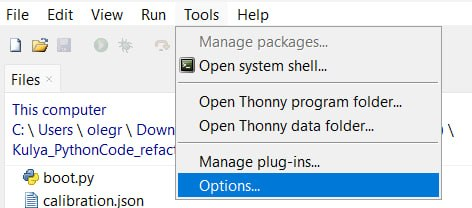
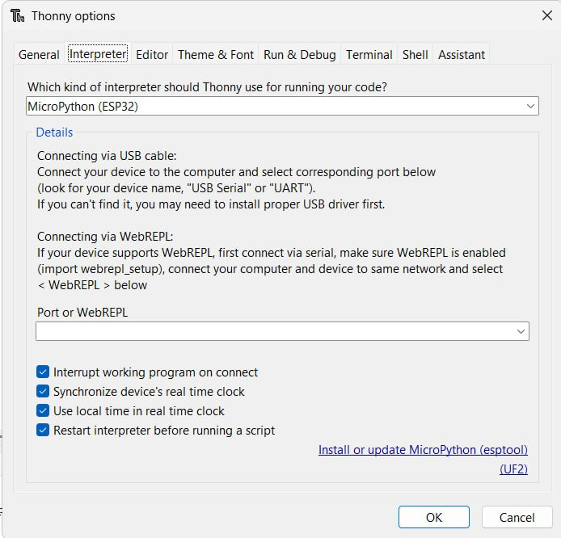
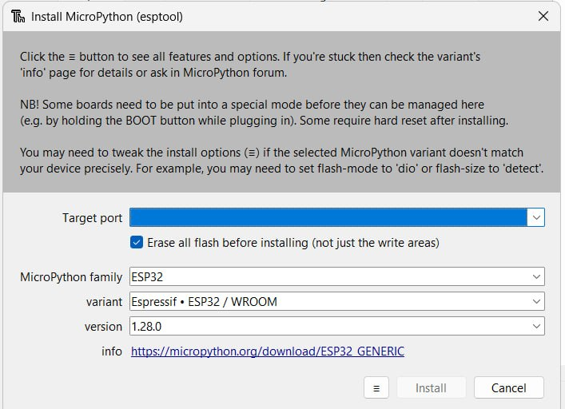
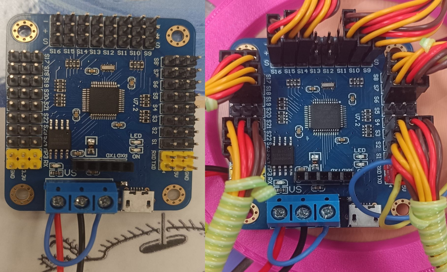

# Kulya Firmware

**Language / Мова:** [English](#english) | [Українська](#українська)

---

# English

## About the Project

An enhanced firmware for the Ukrainian Robotics Kulya 4.0 hexapod with improved robot behavior, configuration, and hardware setup.

## About Ukrainian Robotics – Kulya 4.0

Ukrainian Robotics – Kulya 4.0 is an open-source hexapod robot platform designed for education, robotics research, and DIY enthusiasts.

This repository is not an official Ukrainian Robotics project. It is an independent software project that extends and improves the original platform by providing alternative firmware, controllers, and software tools.

**Official project:** [Ukrainian Robotics – Kulya 4.0](https://www.ukrainerobotics.com/en/diy)

## Related Projects
| Project                      | Description                        |
| ---------------------------- | ---------------------------------- |
| [**Kulya Firmware**](https://github.com/T0riU/Kulya_Firmware)           | Robot firmware and configuration   |
| [**Kulya ESP32 Controller**](https://github.com/T0riU/Kulya_Esp32_Controller)   | ESP32 physical controller firmware |
| [**Kulya Python Controller**](https://github.com/T0riU/Kulya_Py_ControllerAndCalibration) | PC controller and calibration      |
| [**Kulya Android Controller**](https://github.com/T0riU/Kulya_Controller) | Android mobile controller          |

## Installation

Setup was done "on the knee" (quick and dirty, not a polished workflow, but it works).

1. Install [Thonny 5.0.0](https://thonny.org) — the IDE used to flash and manage the board.
2. Install the [USB → UART bridge (VCP) drivers](https://www.silabs.com/software-and-tools/usb-to-uart-bridge-vcp-drivers?tab=downloads).
3. Open Thonny and go to **Tools → Options...** .
4. Connect the ESP32 to the computer, select **MicroPython (ESP32)** as the interpreter, then click **Install or update MicroPython (esptool)** .
5. In the installer, select the target port (should be detected automatically), pick the correct parameters for your specific ESP32 board, and click **Install** to flash the firmware .
6. To access the board's file system *(screenshot placeholder: file system view)*, the following sequence is used (not necessarily "correct", but it reliably works):
   - Connect the ESP32
   - After the USB connection sound plays → press the **Stop** button (`Ctrl+F2`)
   - `Ctrl+C`
   - `Ctrl+C` again

   `Stop` triggers a soft reboot, and the two `Ctrl+C` presses interrupt the firmware's boot sequence so it doesn't start running before you can upload files.
7. Select all files from the `f/` folder (hold **Shift**) and click **"Upload to /"**. All files go to the board's root — there are no subfolders.
### Wiring



Servo wire colors: **brown = ground (–)**, **red = power (+)**, **yellow = signal (S)**.

Connect **RX/TX** on the servo controller board to **TX2/RX2** on the ESP32 — crossed over (RX↔TX) so that transmit lines feed into receive lines on each side.

| Channel (number) | Connects to | Joint |
|---|---|---|
| 1 | Right front leg (leg0) | Coxa (hip) |
| 2 | Right front leg (leg0) | Femur (thigh) |
| 3 | Right front leg (leg0) | Tibia (shin) |
| 4, 5 | — not used — | — |
| 6 | Left front leg (leg1) | Coxa |
| 7 | Left front leg (leg1) | Femur |
| 8 | Left front leg (leg1) | Tibia |
| 9 | Left middle leg (leg2) | Coxa |
| 10 | Left middle leg (leg2) | Femur |
| 11 | Left middle leg (leg2) | Tibia |
| 12, 13 | — not used — | — |
| 14 | Left rear leg (leg3) | Coxa |
| 15 | Left rear leg (leg3) | Femur |
| 16 | Left rear leg (leg3) | Tibia |
| 17 | Right rear leg (leg4) | Coxa |
| 18 | Right rear leg (leg4) | Femur |
| 19 | Right rear leg (leg4) | Tibia |
| 20, 21 | — not used — | — |
| 22 | Right middle leg (leg5) | Coxa |
| 23 | Right middle leg (leg5) | Femur |
| 24 | Right middle leg (leg5) | Tibia |

## How It Works

The firmware is a **single loop with no threads**. Every tick it reads commands, computes target angles for the active gait, smooths them, and sends only the changed channels to the servo controller over UART.

### Startup

**`boot.py`** — runs on power-on. Optionally raises the CPU clock, waits `boot_delay_s` (3 s by default) so you can press `Ctrl+C` and get the REPL, then runs `main.run()` inside `try/except`. On a crash it prints the traceback and either stays in the REPL (default) or reboots after `reset_on_crash_s` seconds.

**`main.py`** — creates the servo bus, `Robot`, `State` and `Engine`, starts BLE and ESP-NOW (each is optional — if one fails, the robot still boots), then runs the main loop. The first move after power-on uses a slow, safe speed (`vmax_boot`). If a tick raises an error, the robot falls back to `STOP`; only 25 errors in a row are fatal.

### Files

| File | Role |
|---|---|
| `kconfig.py` | Loads defaults + `config.json`, `legs_config.json`, `calibration.json`, `radio_config.json` |
| `proto.py` | `State` (all control parameters, the old `RC_data`) and the command parser. Values are validated and clamped; `J_XY` joystick handling and dead zone |
| `engine.py` | The loop logic: link failsafe, one-shot actions (`SAVE`/`GETCAL`), smooth transition when the gait changes (`Settle`), calls the active gait |
| `robot.py` | Joint state (`tgt` / `cur`), time-based interpolator, converts angles to pulses (hard clamp 500–2500 µs), sends only changed channels |
| `kin.py` | Inverse kinematics (pure math, also runs on a PC) |
| `servo.py` | The UART connection to the ch24 servo controller |
| `radio_ble.py` | BLE server (Nordic UART Service). Each write is parsed immediately — no `\n` needed. On disconnect → `STOP` |
| `radio_espnow.py` | ESP-NOW receiver (physical remote). Drains the whole queue on every poll; optional MAC allowlist |
| `gait_base.py` | Base class for gaits |
| `gait_walk.py` | `WALK` / `STOP` |
| `gait_pose.py` | `CE`, `LEG`, `ROLL` |
| `gait_show.py` | `DANCE`, `WAVE` |
| `gait_cal.py` | `ZERO`, `ZEROALL`, `CAL`, saving calibration |
| `dances_data.py` | Dances as data — add your own by appending to `DANCES` |

### Gaits

Each gait is an object with `enter()` / `step(dt)` / `exit()`, registered in `engine.py`. When the gait changes, the robot first moves smoothly into the new gait's starting pose, then the gait takes over — no jerk. Walking is computed continuously in Cartesian space (stance is a line, swing is an arc), so start/stop are smooth and the legs don't lift when the stride is zero.

### JSON Configuration Files — Changeable Without Reflashing

#### `legs_config.json` — hardware wiring (not written by code automatically, edit by hand)

```json
{
  "legs_clockwise": true,
  "0": {"pins": [1, 2, 3],    "invert": [true, false, true]},
  "1": {"pins": [6, 7, 8],    "invert": [true, false, true]},
  "2": {"pins": [9, 10, 11],  "invert": [true, false, true]},
  "3": {"pins": [14, 15, 16], "invert": [true, false, true]},
  "4": {"pins": [17, 18, 19], "invert": [true, false, true]},
  "5": {"pins": [22, 23, 24], "invert": [true, false, true]}
}
```

- **`legs_clockwise`** (`true`/`false`) — the direction legs are traversed around the body (clockwise or counter-clockwise). Flipping this one value inverts the order of all six angles at once. Check it by turning during `WALK` — if the robot turns the wrong way, flip this value.
- **`"0".."5"`** — one entry per leg:
  - `pins` — `[coxa_pin, femur_pin, tibia_pin]`, the channels on the ch24 servo controller
  - `invert` — `[coxa, femur, tibia]`, whether to mirror (`3000 - pulse`) the pulse on that joint of that leg. Needed when servos on different legs are physically mounted differently.

Read once at startup — changes require rebooting the board.
If `legs_config.json` is missing or invalid (wrong pin count, duplicate pins), the firmware falls back to built-in wiring and prints a warning in the REPL.
#### `calibration.json` — calibration (written automatically by the `SAVE` gait)

```json
{"0": [0, 0, 0], "1": [0, 0, 0], "2": [0, 0, 0], "3": [0, 0, 0], "4": [0, 0, 0], "5": [0, 0, 0]}
```

`{"leg_num": [coxa_offset, femur_offset, tibia_offset]}`, in degrees. If the file doesn't exist, every leg starts with a `[0,0,0]` calibration. It can be edited by hand, but it's usually easier to do it through the `CAL` + `SAVE` gaits from the remote.

#### `config.json` — everything else (optional, only list what you want to change)

Missing keys use built-in defaults, and nested sections are merged. The shipped file:

```json
{
  "debug": false,
  "reset_on_crash_s": 0,
  "joy": {"deadzone": 6},
  "walk": {"min_samples": 0}
}
```

| Key | Default | Meaning |
|---|---|---|
| `ble_name` | `KULYA v4 OpenSource DIY` | BLE name (kept so the app finds the robot) |
| `boot_delay_s` | 3 | Window to press `Ctrl+C` before startup |
| `reset_on_crash_s` | 0 | `0` = stay in REPL after a crash; `>0` = reboot after N seconds |
| `debug` | false | Prints state ~2×/s (slow, keep off) |
| `wdt_ms` | 0 | Hardware watchdog (0 = off) |
| `cpu_freq_mhz` | 0 | `0` = default; e.g. `240` for max clock |
| `uart` | `id 2, baud 9600` | Servo controller UART. **Raise `baud` to 115200 if your controller supports it** — motion becomes much smoother |
| `tick_ms` | 20 | Target loop period (auto-stretched if UART is slow) |
| `geometry`, `poses` | — | Leg dimensions, joint limits, fold pose |
| `motion` | — | Speed caps and smoothing |
| `walk` | — | `cycle_ms`, lift height, `min_samples` |
| `joy.deadzone` | 6 | Joystick dead zone, % |
| `link.timeout_ms` | 0 | `>0` = stop the robot if no command arrives for N ms |
| `link.espnow_peers` | `[]` | Allowed remote MACs; empty = accept anyone |
| `dance` | — | `lift_mm`, `move_frac` |

#### `radio_config.json` — ESP-NOW channel (optional)

```json
{"channel": 6}
```
Channel 1–14, default 6. Must match the remote.

`{"leg_num": [coxa_offset, femur_offset, tibia_offset]}`, in degrees. If the file doesn't exist, every leg starts with a `[0,0,0]` calibration. It can be edited by hand, but it's usually easier to do it through the `CAL` + `SAVE` gaits from the remote.

### Full Command Reference

Format: `gait:NAME;parameter:value;parameter:value;` (or just `parameter:value;` without changing the gait — updates the state on the fly). Values are validated and clamped to a safe range; fractional numbers (`speed:50.5`) are accepted; bad pairs are skipped.

| Gait | Parameters | What It Does |
|---|---|---|
| `WALK` | `speed, height, raise, spread, turn_angle, dx, dy, rx, ry, rz, wtype` | Walking. `wtype`: `0` tripod, `1` pairs, `2` wave (one leg at a time). `speed:0` — stand still, holding the pose |
| `STOP` | — | Smooth return to the standing pose (not a freeze) |
| `CE` | `ce_value` (0-100) | Synchronously folds/unfolds all legs |
| `ROLL` | `speed, roll_range, roll_turn` | Experimental — opens legs one by one around the circle |
| `LEG` | `leg_num, coxa, femur, tibia` | Manual jog of a single leg (absolute angle, clamped to joint limits) |
| `CAL` | `leg_num, coxa, femur, tibia` | Calibration offset (±20° max). Only the fields you actually send are changed |
| `ZERO` | `leg_num` | One leg to the servo's true center (1500 µs), ignoring calibration — for mounting the horn |
| `ZEROALL` | — | Same as `ZERO`, for all legs |
| `SAVE` | — | One-shot: writes calibration to `calibration.json` (atomic write), then switches to `CAL` |
| `GETCAL` | `leg_num` | One-shot: replies `CAL:coxa,femur,tibia;` via BLE notify, then switches to `CAL` |
| `WAVE` | `leg_num` | Any leg waves, then automatically returns to `WALK` |
| `DANCE` | `dance_id` (0–9, `255` = all), `tempo` (20–300, default 100) | Dances in a loop until the gait is changed; both can be changed on the fly |
| — (not a gait) | `J_XY:x\|y` (-100..100) | Joystick input, converted depending on `J_mode`. A real deflection in `steer`/`sides` returns the robot to `WALK` from `STOP`/`DANCE`/`CE`/`ROLL`/`WAVE` |
| — (not a gait) | `J_mode` (`steer`/`sides`/`shift`/`tilt`/`yaw`) | How to interpret the joystick. `yaw` rotates the body in place |
| — (not a gait) | `espi`, `servoi` | Update intervals (ms), rarely need touching |

#### Dances (`dance_id`)

| id | Name | id | Name |
|---|---|---|---|
| 0 | Sway | 5 | Breathe |
| 1 | Bounce | 6 | Squats |
| 2 | Shimmy | 7 | Disco |
| 3 | Hula | 8 | Heartbeat |
| 4 | March | 9 | Twist |

`255` plays all of them back to back.

#### Dances (`dance_id`)

- **0 — Sway**: slow forward/back/side tilts + rotations
- **1 — Bounce**: fast crouch-and-rise + spins

## Usage

Send commands to the board over BLE (Nordic UART Service) or ESP-NOW, using the `gait:NAME;param:value;param:value;\n` format described above. A trailing newline (`\n`) is required over BLE so the parser knows a full command has arrived.

Typical workflow examples:
- **Walking:** `gait:WALK;speed:50;height:20;spread:30;turn_angle:0;\n`
- **Calibrating a leg:** switch to `gait:CAL;leg_num:0;coxa:2;femur:-1;tibia:0;\n`, adjust offsets, then send `gait:SAVE;\n` to persist them to `calibration.json`
- **Reading back calibration:** `gait:GETCAL;leg_num:0;\n` — the board replies over BLE notify with `CAL:0:coxa,femur,tibia;`
- **Joystick control:** set the interpretation mode first with `J_mode:steer;\n`, then stream `J_XY:x|y;\n` values from -100 to 100
- Any parameter can also be updated on its own (`speed:0;\n`) without switching gaits, and it will be applied immediately by the currently active gait

## Notes

This code isn't intended to be perfect — it's not a polished, production-grade reference implementation. If you run into anything unclear, buggy, or if you have questions about how or why something works a certain way, feel free to open an issue or reach out and ask.

---

# Українська

## Про проєкт

Покращена прошивка для гексапода Ukrainian Robotics Kulya 4.0 з покращеною поведінкою робота, конфігурацією та налаштуванням апаратної частини.

## Про Ukrainian Robotics – Kulya 4.0

Ukrainian Robotics – Kulya 4.0 — це платформа гексапода з відкритим кодом, створена для освіти, робототехнічних досліджень та DIY-ентузіастів.

Цей репозиторій не є офіційним проєктом Ukrainian Robotics. Це незалежний софтверний проєкт, що розширює та покращує оригінальну платформу, надаючи альтернативну прошивку, контролери та програмні інструменти.

**Офіційний проєкт:** [Ukrainian Robotics – Kulya 4.0](https://www.ukrainerobotics.com/diy)

## Пов'язані проєкти
| Проєкт                      | Опис                        |
| ---------------------------- | ---------------------------------- |
| [**Kulya Firmware**](https://github.com/T0riU/Kulya_Firmware)           | Прошивка та конфігурація робота   |
| [**Kulya ESP32 Controller**](https://github.com/T0riU/Kulya_Esp32_Controller)   | Прошивка фізичного пульта на ESP32 |
| [**Kulya Python Controller**](https://github.com/T0riU/Kulya_Py_ControllerAndCalibration) | ПК-контролер і калібрування      |
| [**Kulya Android Controller**](https://github.com/T0riU/Kulya_Controller) | Android-контролер          |

## Встановлення

Установка написана "на коліні" (без вилизаного процесу, але робоче).

1. Встановити [Thonny 5.0.0](https://thonny.org) — IDE, яка використовується для прошивки й роботи з платою.
2. Встановити [драйвери USB → UART (VCP)](https://www.silabs.com/software-and-tools/usb-to-uart-bridge-vcp-drivers?tab=downloads).
3. Відкрити Thonny і зайти в **Tools → Options...** *(тут буде картинка куди натискати)*.
4. Підключити ESP32 до комп'ютера, вибрати інтерпретатор **MicroPython (ESP32)**, натиснути **Install or update MicroPython (esptool)** *(картинка меню налаштувань)*.
5. У встановлювачі вибрати target port (має визначитись автоматично), вибрати параметри для вашої конкретної плати ESP32 і встановити прошивку, натиснувши **Install** *(картинка налаштувань установки)*.
6. Щоб зайти у файлову систему плати *(картинка файлової системи)*, використовується такий порядок (це наврядчи "правильно", але надійно працює):
   - Підключити ESP32
   - Після звуку USB-підключення → натиснути кнопку **Stop** (`Ctrl+F2`)
   - `Ctrl+C`
   - `Ctrl+C` ще раз

   `Stop` вмикає софт-ребут, а два `Ctrl+C` зупиняють завантаження прошивки, щоб вона не встигла запуститись до того, як можна буде завантажити файли.
7. Вибрати всі файли з папки `f/` (утримуючи **Shift**) і натиснути **"Upload to /"**. Усі файли йдуть у корінь плати — підпапок немає.

### Підключення

*(тут буде фото плати)*

Кольори проводів сервоприводу: **коричневий = земля (–)**, **червоний = живлення (+)**, **жовтий = сигнал (S)**.

**RX/TX** на платі сервоконтролера підключаються до **TX2/RX2** на ESP32 — навхрест (RX↔TX), щоб лінія передачі однієї сторони йшла в лінію прийому іншої.

| Канал на платі (число) | Куди підключати | Суглоб |
|---|---|---|
| 1 | Права передня нога (leg0) | Coxa (тазостегновий) |
| 2 | Права передня нога (leg0) | Femur (стегновий) |
| 3 | Права передня нога (leg0) | Tibia (гомілковий) |
| 4, 5 | — не використовуються — | — |
| 6 | Ліва передня нога (leg1) | Coxa |
| 7 | Ліва передня нога (leg1) | Femur |
| 8 | Ліва передня нога (leg1) | Tibia |
| 9 | Ліва середня нога (leg2) | Coxa |
| 10 | Ліва середня нога (leg2) | Femur |
| 11 | Ліва середня нога (leg2) | Tibia |
| 12, 13 | — не використовуються — | — |
| 14 | Ліва задня нога (leg3) | Coxa |
| 15 | Ліва задня нога (leg3) | Femur |
| 16 | Ліва задня нога (leg3) | Tibia |
| 17 | Права задня нога (leg4) | Coxa |
| 18 | Права задня нога (leg4) | Femur |
| 19 | Права задня нога (leg4) | Tibia |
| 20, 21 | — не використовуються — | — |
| 22 | Права середня нога (leg5) | Coxa |
| 23 | Права середня нога (leg5) | Femur |
| 24 | Права середня нога (leg5) | Tibia |

## Як це працює

Прошивка — **один цикл без потоків**. Кожен тік: читає команди, рахує цільові кути для активного гейта, згладжує їх і шле на сервоконтролер по UART лише ті канали, що змінились.

### Запуск

**`boot.py`** — виконується при старті плати. За потреби піднімає частоту CPU, чекає `boot_delay_s` (за замовчуванням 3 с), щоб встигнути натиснути `Ctrl+C` і потрапити в REPL, потім викликає `main.run()` у `try/except`. При збої друкує traceback і або лишається в REPL (за замовчуванням), або перезавантажується через `reset_on_crash_s` секунд.

**`main.py`** — створює шину серво, `Robot`, `State` та `Engine`, запускає BLE та ESP-NOW (кожен необов'язковий — якщо один не стартував, робот все одно завантажиться) і крутить головний цикл. Перший рух після старту — повільний і безпечний (`vmax_boot`). Якщо тік кидає помилку, робот відкочується в `STOP`; фатальними є лише 25 помилок підряд.

### Файли

| Файл | Роль |
|---|---|
| `kconfig.py` | Завантажує значення за замовчуванням + `config.json`, `legs_config.json`, `calibration.json`, `radio_config.json` |
| `proto.py` | `State` (усі параметри керування, колишній `RC_data`) і парсер команд. Значення перевіряються й обрізаються; обробка джойстика `J_XY` та мертва зона |
| `engine.py` | Логіка циклу: failsafe за зв'язком, одноразові дії (`SAVE`/`GETCAL`), плавний перехід при зміні гейта (`Settle`), виклик активного гейта |
| `robot.py` | Стан суглобів (`tgt` / `cur`), інтерполятор за часом, перетворення кутів в імпульси (жорсткий кламп 500–2500 мкс), відправка лише змінених каналів |
| `kin.py` | Зворотна кінематика (чиста математика, працює і на ПК) |
| `servo.py` | UART-з'єднання з ch24-сервоконтролером |
| `radio_ble.py` | BLE-сервер (Nordic UART Service). Кожен запис парситься одразу — `\n` не потрібен. При відключенні → `STOP` |
| `radio_espnow.py` | Приймач ESP-NOW (фізичний пульт). На кожному опитуванні вичитує всю чергу; опційний список дозволених MAC |
| `gait_base.py` | Базовий клас гейтів |
| `gait_walk.py` | `WALK` / `STOP` |
| `gait_pose.py` | `CE`, `LEG`, `ROLL` |
| `gait_show.py` | `DANCE`, `WAVE` |
| `gait_cal.py` | `ZERO`, `ZEROALL`, `CAL`, збереження калібрування |
| `dances_data.py` | Танці як дані — свій танець додається в кінець `DANCES` |

### Гейти

Кожен гейт — об'єкт з `enter()` / `step(dt)` / `exit()`, зареєстрований в `engine.py`. При зміні гейта робот спершу плавно переходить у стартову позу нового гейта, і лише потім той бере керування — без ривка. Ходьба рахується безперервно в декартових координатах (опора — пряма, перенос — дуга), тому старт/зупинка плавні, а ноги не піднімаються при нульовому кроці.
### JSON-конфіги — що можна міняти без перепрошивки коду

#### `legs_config.json` — залізо (не пишеться кодом автоматично, редагуй руками)

```json
{
  "legs_clockwise": true,
  "0": {"pins": [1, 2, 3],    "invert": [true, false, true]},
  "1": {"pins": [6, 7, 8],    "invert": [true, false, true]},
  "2": {"pins": [9, 10, 11],  "invert": [true, false, true]},
  "3": {"pins": [14, 15, 16], "invert": [true, false, true]},
  "4": {"pins": [17, 18, 19], "invert": [true, false, true]},
  "5": {"pins": [22, 23, 24], "invert": [true, false, true]}
}
```

- **`legs_clockwise`** (`true`/`false`) — напрямок обходу ніг по колу корпуса (за годинниковою чи проти). Одне значення інвертує порядок усіх шести кутів одразу. Перевіряється поворотом при `WALK` — якщо крутить не туди, куди очікуєш, зміни це значення.
- **`"0".."5"`** — кожна нога:
  - `pins` — `[coxa_pin, femur_pin, tibia_pin]`, канали на ch24-контролері
  - `invert` — `[coxa, femur, tibia]`, чи дзеркалити (`3000 - pulse`) імпульс на цьому суглобі цієї ноги. Потрібно, якщо сервоприводи на різних ногах фізично закріплені по-різному.

Читається один раз при старті — зміни вимагають перезавантаження плати.
Якщо `legs_config.json` не знайдено або він некоректний (неправильна кількість пінів, дублікати), використовується вбудований wiring і в REPL виводиться попередження.

#### `calibration.json` — калібрування (пишеться автоматично гейтом `SAVE`)

```json
{"0": [0, 0, 0], "1": [0, 0, 0], "2": [0, 0, 0], "3": [0, 0, 0], "4": [0, 0, 0], "5": [0, 0, 0]}
```

`{"leg_num": [coxa_offset, femur_offset, tibia_offset]}`, градуси. Якщо файлу немає — усі ноги стартують з калібруванням `[0,0,0]`. Редагувати руками можна, але зазвичай простіше через гейт `CAL` + `SAVE` з пульта.
#### `config.json` — решта налаштувань (необов'язковий, пишіть лише те, що хочете змінити)

Відсутні ключі беруть значення за замовчуванням, вкладені секції зливаються. Файл у збірці:

```json
{
  "debug": false,
  "reset_on_crash_s": 0,
  "joy": {"deadzone": 6},
  "walk": {"min_samples": 0}
}
```

| Ключ | За замовч. | Значення |
|---|---|---|
| `ble_name` | `KULYA v4 OpenSource DIY` | Ім'я BLE (лишили, щоб застосунок знаходив робота) |
| `boot_delay_s` | 3 | Вікно для `Ctrl+C` перед стартом |
| `reset_on_crash_s` | 0 | `0` = лишитись у REPL після збою; `>0` = перезавантаження через N с |
| `debug` | false | Друк стану ~2×/с (повільно, вимкнено) |
| `wdt_ms` | 0 | Апаратний watchdog (0 = вимкнено) |
| `cpu_freq_mhz` | 0 | `0` = за замовчуванням; напр. `240` — максимум |
| `uart` | `id 2, baud 9600` | UART сервоконтролера. **Підніміть `baud` до 115200, якщо контролер підтримує** — рух стане набагато плавнішим |
| `tick_ms` | 20 | Цільовий період циклу (автоматично збільшується при повільному UART) |
| `geometry`, `poses` | — | Розміри ніг, ліміти суглобів, складена поза |
| `motion` | — | Ліміти швидкості та згладжування |
| `walk` | — | `cycle_ms`, висота підйому, `min_samples` |
| `joy.deadzone` | 6 | Мертва зона джойстика, % |
| `link.timeout_ms` | 0 | `>0` = зупинити робота, якщо команд немає N мс |
| `link.espnow_peers` | `[]` | Дозволені MAC пультів; порожньо = приймати від усіх |
| `dance` | — | `lift_mm`, `move_frac` |

#### `radio_config.json` — канал ESP-NOW (необов'язковий)

```json
{"channel": 6}
```
Канал 1–14, за замовчуванням 6. Має збігатися з пультом.
### Всі команди

Формат: `gait:ІМ'Я;параметр:значення;параметр:значення;` (або просто `параметр:значення;` без зміни гейта — оновлює стан на льоту). Значення перевіряються й обрізаються до безпечного діапазону; дробові числа (`speed:50.5`) приймаються; некоректні пари пропускаються.

| Гейт | Параметри | Що робить |
|---|---|---|
| `WALK` | `speed, height, raise, spread, turn_angle, dx, dy, rx, ry, rz, wtype` | Ходьба. `wtype`: `0` тріпод, `1` пари, `2` хвиля (по одній нозі). `speed:0` — стояти, тримаючи позу |
| `STOP` | — | Плавне повернення в стійку (не «застигання») |
| `CE` | `ce_value` (0-100) | Синхронне складання/розкладання всіх ніг |
| `ROLL` | `speed, roll_range, roll_turn` | Експериментальна — по черзі відкриває ноги по колу |
| `LEG` | `leg_num, coxa, femur, tibia` | Ручний джог однієї ноги (абсолютний кут, обрізається лімітами суглоба) |
| `CAL` | `leg_num, coxa, femur, tibia` | Офсет калібрування (±20° макс). Змінюються лише ті поля, що реально надіслані |
| `ZERO` | `leg_num` | Одна нога в чистий центр серво (1500 мкс), ігнорує калібрування — для монтажу рожка |
| `ZEROALL` | — | Те саме, для всіх ніг |
| `SAVE` | — | Одноразово: пише калібрування в `calibration.json` (атомарний запис), далі перехід у `CAL` |
| `GETCAL` | `leg_num` | Одноразово: шле `CAL:coxa,femur,tibia;` через BLE notify, далі перехід у `CAL` |
| `WAVE` | `leg_num` | Махає будь-яка нога, потім автоматично повертається в `WALK` |
| `DANCE` | `dance_id` (0–9, `255` = усі), `tempo` (20–300, за замовч. 100) | Танцює по колу, поки не зміниш гейт; обидва параметри можна міняти на льоту |
| — (не гейт) | `J_XY:x\|y` (-100..100) | Джойстик, конвертується залежно від `J_mode`. Реальне відхилення в `steer`/`sides` повертає робота в `WALK` зі `STOP`/`DANCE`/`CE`/`ROLL`/`WAVE` |
| — (не гейт) | `J_mode` (`steer`/`sides`/`shift`/`tilt`/`yaw`) | Як інтерпретувати джойстик. `yaw` — поворот корпусу на місці |
| — (не гейт) | `espi`, `servoi` | Інтервали оновлення (мс), рідко треба чіпати |

#### Танці (`dance_id`)

| id | Назва | id | Назва |
|---|---|---|---|
| 0 | Sway | 5 | Breathe |
| 1 | Bounce | 6 | Squats |
| 2 | Shimmy | 7 | Disco |
| 3 | Hula | 8 | Heartbeat |
| 4 | March | 9 | Twist |

`255` програє всі підряд.

## Використання

Команди надсилаються на плату через BLE (Nordic UART Service) або ESP-NOW у форматі `gait:ИМЯ;параметр:значення;параметр:значення;\n`, описаному вище. Через BLE обов'язково потрібен символ переносу рядка (`\n`) наприкінці, щоб парсер зрозумів, що команда прийшла повністю.

Типові приклади використання:
- **Ходьба:** `gait:WALK;speed:50;height:20;spread:30;turn_angle:0;\n`
- **Калібрування ноги:** перейти в `gait:CAL;leg_num:0;coxa:2;femur:-1;tibia:0;\n`, підібрати офсети, потім надіслати `gait:SAVE;\n`, щоб зберегти їх у `calibration.json`
- **Зчитування калібрування:** `gait:GETCAL;leg_num:0;\n` — плата відповість через BLE notify рядком `CAL:0:coxa,femur,tibia;`
- **Керування джойстиком:** спочатку задати режим інтерпретації `J_mode:steer;\n`, потім слати значення `J_XY:x|y;\n` від -100 до 100
- Будь-який параметр можна оновити окремо (`speed:0;\n`) без зміни гейта — активний гейт застосує його одразу

## Примітки

Цей код не претендує на ідеальність — це не вилизана, продакшн-грейд реалізація. Якщо щось незрозуміло, знайшли баг, або є питання по тому, як і чому щось працює саме так — не соромтесь відкрити issue або написати й запитати.